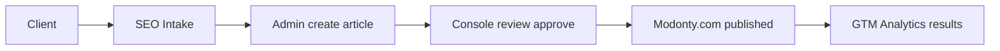

# MODONTY Business Model Guidelines

**Purpose:** Single reference for team and partners on what Modonty sells, what it provides to clients, and how the business model works. Use for onboarding, sales, and product alignment.

---

## 1. What we sell (the offer)

- **Product:** Subscription-based **Arabic SEO content** — ready-made articles delivered on a monthly quota. Clients do not write; they fill an intake form and receive articles to approve.
- **Authority Blog System:** One central blog (Modonty.com) that grows with every article. Each article mentions the client naturally and includes links to the client’s site. More articles → stronger domain authority → stronger backlinks for all clients.
- **Value proposition:** No in-house writing; clear monthly quota; **18 months of delivery for 12 months of pay**; ~90% cost saving vs traditional SEO agencies.

---

## 2. Subscription tiers and pricing

| Tier     | Price (SAR/year) | Articles/month | Target market              |
|----------|------------------|----------------|----------------------------|
| Basic    | 2,499            | 2              | Small businesses, startups  |
| Standard | 3,999            | 4              | Growing companies (most popular) |
| Pro      | 6,999            | 8              | Established companies      |
| Premium  | 9,999            | 12             | Large companies, agencies   |

**Rules:**

- **Payment:** 12 months.
- **Delivery:** 18 months. `subscriptionEndDate = subscriptionStartDate + 18 months`.
- **Quota:** `articlesPerMonth` comes from tier (can be overridden manually in system).
- **Schema (MODONTY repo):** `SubscriptionTier` enum (BASIC, STANDARD, PRO, PREMIUM), `SubscriptionTierConfig` (tier, articlesPerMonth, price).

---

## 3. What we provide to clients

### Onboarding

- **SEO intake:** Long questionnaire (~100 questions in 14–22 sections) covering: business, goals, audience, tech, keywords, competitors, content, local SEO, compliance, timeline.  
  **See MODONTY repo:** `documents/SEO_CLIENT_INTAKE_FINAL_AR.md` (Arabic), `documents/SEO_CLIENT_INTAKE_QUESTIONNAIRE.md`.

### Content delivery

- Articles in the **client console**: tabs for *pending approval*, *published*, *all*; monthly quota and content library.
- Client **approves** or **requests changes**; no writing inside the app.
- Article lifecycle: WRITING (content team) → DRAFT (client review) → PUBLISHED (live on Authority Blog).

### Authority Blog (Modonty.com)

- Published articles live on the public site with: Schema.org (Article, Organization), Open Graph, Twitter Cards, Canonical URLs, JSON-LD, sitemap, Core Web Vitals.
- Each article links to the client’s site; cumulative domain authority benefits all clients.

### Analytics and reporting

- **GTM integration:** Client sees traffic and conversions in their own Analytics.
- **Client console:** Dashboard, articles, content quota, analytics, comments, subscribers, campaigns, **Leads** (HOT/WARM/COLD after “Refresh scores”).

### Tracked events (implemented)

- **Views:** ArticleView, ClientView.
- **Engagement:** ArticleLike, ArticleDislike, ArticleFavorite; Share (article + client profile); Comment and replies; CommentLike/CommentDislike.
- **Conversions:** ContactMessage, User (registration), Subscriber (client newsletter), NewsSubscriber (global); Conversion table (CONTACT_FORM, SIGNUP, NEWSLETTER).
- **CTAs:** 20+ CTAs (e.g. Read more, Subscribe, Visit client, Ask client, Comment, Share, Related articles, Visit website; full client-page coverage).
- **Other:** ArticleLinkClick (in-article links), ArticleFAQ (ask-client), ClientLike (follow), FAQFeedback.
- **Session:** Analytics row per article view with time on page, scroll depth, bounce, source/referrer.
- **Lead scoring:** Filled by console “Refresh scores” (HOT/WARM/COLD).  
  **See MODONTY repo:** `console/docs/MARKETING_ANALYTICS_BRIEF.md`, `console/docs/Important_ANALYTICS_DATA_SOURCES_REPORT.md`, `console/docs/CTA_TRACKING_TARGETS.md`.

### Referral

- Invite a colleague → **5 free articles**.

---

## 4. Client journey (end-to-end)

1. **Sign up** → choose tier → pay (payment gateway planned).
2. **Complete SEO intake** (~100 questions, 14–22 sections).
3. **Content team** creates articles in admin (WRITING → DRAFT).
4. **Client** reviews in console; approves or requests edits.
5. **On approval** → status PUBLISHED → article appears on Modonty.com.
6. **Client** sees results via GTM/Analytics and console dashboards; renewal driven by performance.

---

## 5. Data we collect and store

- **Client:** Profile, subscription (tier, start/end dates, articlesPerMonth, status), GTM ID, business/industry/audience, contact, SEO fields.
- **SeoIntake:** Full questionnaire answers (JSON) per client.
- **ClientCompetitor, ClientKeyword, ClientProject:** From intake (competitors, keywords, goals).
- **Article:** Per client; status WRITING | DRAFT | PUBLISHED | ARCHIVED; SEO fields, content, author, category.
- **SubscriptionTierConfig:** Tier name, articlesPerMonth, price, isActive, isPopular.

**Schema (MODONTY repo):** `dataLayer/prisma/schema/schema.prisma` — models Client, SeoIntake, Article, SubscriptionTierConfig, plus analytics models (ArticleView, ClientView, CTAClick, Conversion, Analytics, etc.).

---

## 6. What we track and report (implemented)

| Category   | Implemented |
|-----------|-------------|
| Views     | ArticleView, ClientView |
| Reactions | ArticleLike, ArticleDislike, ArticleFavorite; Share; Comment, CommentLike, CommentDislike |
| Conversions | ContactMessage, User signup, Subscriber (client + global); Conversion table |
| CTAs      | 20+ CTAs (article + client page full coverage) |
| Links     | ArticleLinkClick (in-article) |
| Session   | Analytics: time on page, scroll depth, bounce, source/referrer |
| Lead scoring | HOT/WARM/COLD via console “Refresh scores” |

**Not yet:** UTM/campaign tracking; ad cost/impressions (planned when using campaign links or ad sync).

---

## 7. Monorepo and apps

| App       | Role |
|----------|------|
| **admin**   | Content team: create/manage/publish articles, manage clients. |
| **console** | Client portal: dashboard, articles, analytics, leads, settings. |
| **modonty** | Public Authority Blog (Modonty.com): articles, client profiles, search. |
| **dataLayer** | Shared Prisma schema and DB for all apps. |

**Location:** MODONTY repo (monorepo with admin, console, modonty, dataLayer).

---

## 8. Strengths (from existing docs)

- **Deep SEO intake** → content tailored to each client (goals, audience, keywords, competitors).
- **Authority Blog** compounds: more clients → more articles → stronger domain → better backlinks for everyone.
- **Transparency:** GTM + console so clients see real performance.
- **Pricing:** 18 months delivery for 12 months pay; ~90% vs traditional agencies.
- **Simple UX:** Fill form → receive articles → approve or request changes → see results.

---

## 9. Challenges and gaps

**Documented gaps (in MODONTY codebase):**

- No enforcement of monthly article cap (`articlesPerMonth`) when creating articles.
- No automatic subscription expiry (cron + email alerts for 7/3/1 days before end).
- No payment gateway or webhooks yet.
- No formal delivery workflow or download links for approved content.
- Client access control (multi-tenant) not fully enforced.
- Some Authority Blog/SEO improvements pending (e.g. image fallback, read time, related articles).

**Risks:**

- Maintaining content quality at scale.
- Proving ROI and managing SEO timeline expectations.
- Operational load as client count grows (intake, scheduling, approvals, renewals).

---

## 10. References and next reads

**In MODONTY repo:**

- `documents/modonty.md` — Business model summary, strengths/weaknesses, gaps (Arabic/English).
- `documents/مدونتي.md` — Full flow, tiers, pricing (SAR), intake sections, checklist, priorities (Arabic).
- `documents/SEO_CLIENT_INTAKE_FINAL_AR.md` — Final Arabic SEO intake (22 sections, ~100 questions).
- `console/docs/MARKETING_ANALYTICS_BRIEF.md` — What we track and what clients can measure.
- `console/docs/Important_ANALYTICS_DATA_SOURCES_REPORT.md` — Implemented events, APIs, testing.
- `console/docs/CTA_TRACKING_TARGETS.md` — 8+ CTAs, locations, payloads.
- `documents/business/` — Business and value-proposition docs.
- `dataLayer/prisma/schema/schema.prisma` — Client, Article, SeoIntake, SubscriptionTierConfig, analytics models.

---

*This guidelines document lives in the JBRSEO repo; content is derived from the MODONTY project documentation and codebase.*
